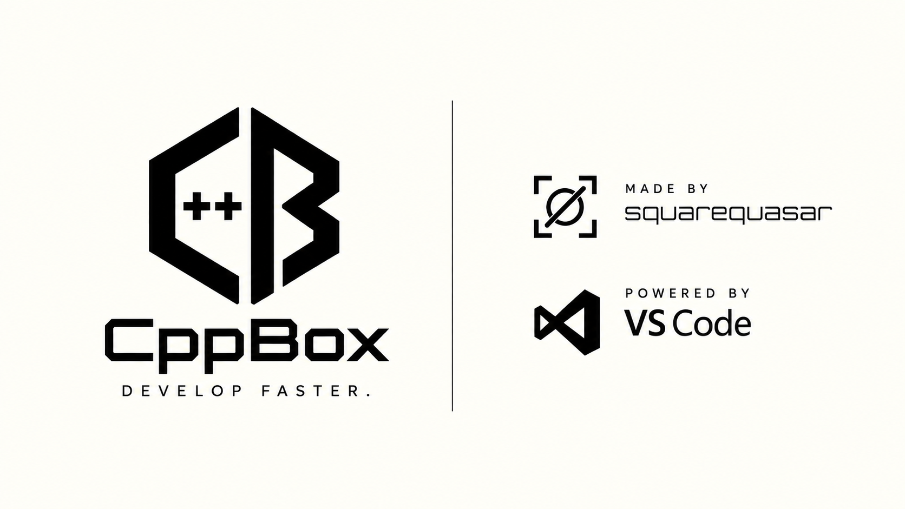

**Portable C++ environment for Windows.**

## What is CppBox?

CppBox is a portable C++ environment for Windows. Its launcher downloads and keeps VS Code and the WinLibs compiler inside the CppBox folder, so they do not need to be installed system-wide. Your source files stay in a clean `workspace` folder.

## Quick Start

1. [Download CppBox v1.0.2](https://github.com/squarequasar/cppbox/releases/tag/v1.0.2).
2. Run `CppBox_Setup_v1.0.2.exe` where you want the `cppbox` folder to be created.
3. Open CppBox using its desktop shortcut and install the environment through the launcher.
4. Open VS Code and trust the workspace when prompted.
5. Create or open a `.cpp` file in `workspace`, save it, and press **F5** to build and debug it.

The launcher downloads VS Code, the compiler, and Microsoft's C/C++ Extension Pack during the initial environment setup. An internet connection is required.

The setup executable removes itself after extracting CppBox. F5 builds the active file; it does not combine all `.cpp` files into one project.

## What's Included

| Component | What it does |
| --- | --- |
| CppBox launcher | Installs and opens the environment, shows installation progress, and provides cancellation and repair actions. |
| Visual Studio Code | Runs from the CppBox folder with separate user data. |
| WinLibs GCC and GDB | Compiles and debugs C++ programs without a system-wide compiler install. |
| Workspace | Keeps `.cpp` source files separate from internal files and build output. |
| C/C++ Extension Pack | Installed automatically by the setup flow into portable VS Code. |

## Requirements

- Windows x64. Windows on ARM is not an officially supported target.
- Internet access during the initial environment setup.
- At least **4 GB of free disk space** for the initial setup. The downloaded components and retained archive cache total approximately **3 GB**; allow additional space for your projects and extra extensions. Component sizes were checked on October 4, 2026 and may change with updates.

## Latest Release: CppBox v1.0.2

CppBox v1.0.2 fixes the F5 build-and-debug configuration for the active C++ file. Build output stays outside the workspace. The installation and launcher features from v1.0.1 are retained.

Previous release: [CppBox v1.0.1](https://github.com/squarequasar/cppbox/releases/tag/v1.0.1).

[Release notes](docs/RELEASE_NOTES_v1.0.2.md)

## Troubleshooting

If build or debugging is unavailable, check that the workspace is trusted and Microsoft's C/C++ extension is installed. If automatic extension installation fails, install **C/C++ Extension Pack** by Microsoft from VS Code's Extensions view.

**Repair resets the environment:** it removes VS Code user settings and extensions, the compiler, and workspace configuration before reinstalling them. Your `.cpp` source files are retained. Back up any custom settings before using Repair.

For other problems, [open an issue](https://github.com/squarequasar/cppbox/issues) with the CppBox version, Windows version, and the error message. Remove personal paths or other private information before sharing logs.

## Developer Information

- [Development log](docs/DEVLOG.txt)
- [Build notes](docs/BUILD_NOTES.txt)
- [Source code](src/)

made by squarequasar
